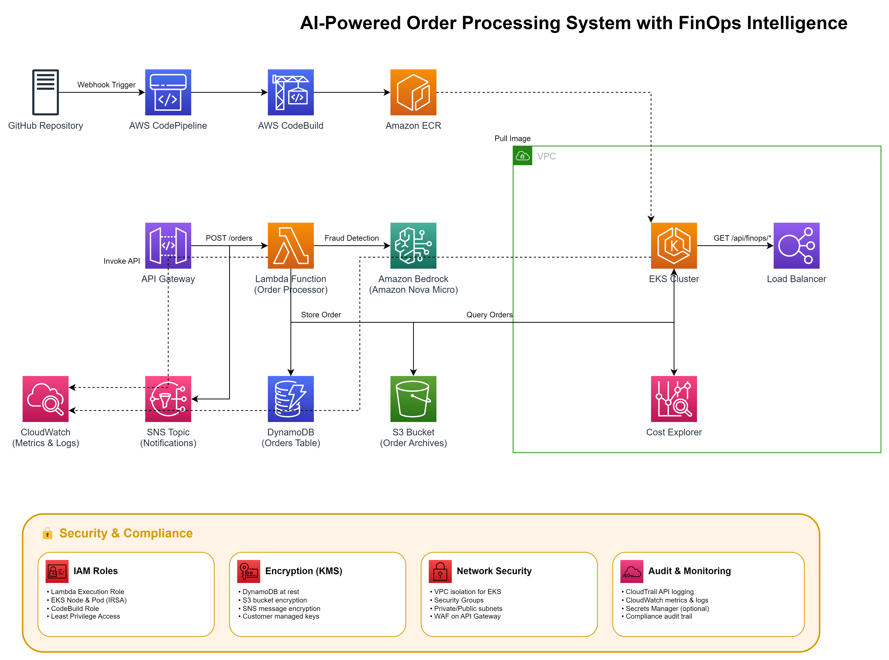
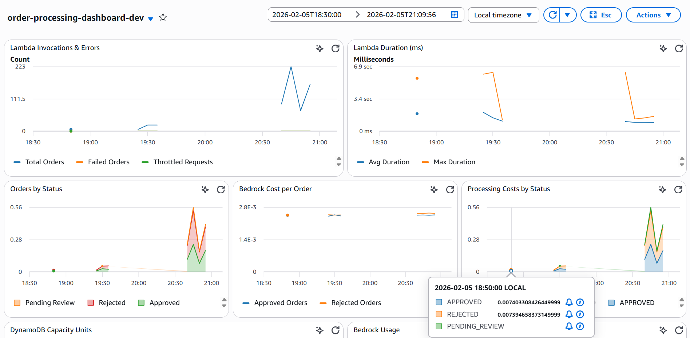
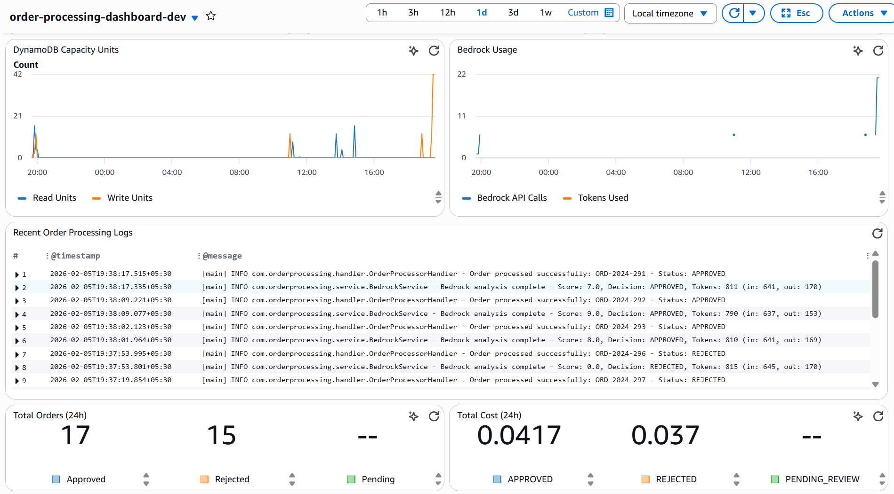

# AI-Powered Order Processing System with FinOps Intelligence

> Enterprise-grade serverless order processing with real-time fraud detection and comprehensive cost tracking

[](https://aws.amazon.com/)
[](https://openjdk.org/)
[](https://www.terraform.io/)

---

## 📋 Table of Contents

- [Overview](#-overview)
- [Architecture](#-architecture)
- [Features](#-features)
- [AWS Services Used](#-aws-services-used)
- [Project Structure](#-project-structure)
- [Prerequisites](#-prerequisites)
- [Setup & Deployment](#-setup--deployment)
- [API Documentation](#-api-documentation)
- [Cost Tracking](#-cost-tracking)
- [CI/CD Pipeline](#-cicd-pipeline)
- [Monitoring](#-monitoring)
- [Troubleshooting](#-troubleshooting)
- [Contributing](#-contributing)

---

## 🎯 Overview

This project demonstrates a **production-ready order processing system** that combines:

- **AI-Powered Fraud Detection**: Uses Amazon Bedrock (Amazon Nova Micro) to analyze orders in real-time
- **Real-Time Cost Tracking**: Calculates processing costs for every transaction (Bedrock, Lambda, DynamoDB, S3, SNS, API Gateway)
- **Hybrid Architecture**: Serverless (Lambda) for order processing + EKS for analytics
- **Complete FinOps Visibility**: REST APIs for metrics, costs, and forecasts
- **Automated CI/CD**: GitHub → CodePipeline → CodeBuild → Lambda + EKS deployment

### Business Use Case

E-commerce platform processing thousands of orders daily needs:
1. **Instant fraud detection** to prevent chargebacks
2. **Cost transparency** to optimize cloud spending
3. **Scalable architecture** to handle traffic spikes
4. **Audit trail** for compliance (S3 archival)

---

## 🏗️ Architecture



### High-Level Flow

```
Customer Order → API Gateway → Lambda (Bedrock Fraud Check) → DynamoDB + S3 + SNS
                                                                      ↓
                                                            EKS Analytics Service
                                                                      ↓
                                                        FinOps Dashboard (REST APIs)
```

### Components

1. **Order Processing (Lambda)**
   - Validates order data
   - Calls Bedrock for AI fraud analysis
   - Stores order in DynamoDB
   - Archives to S3 for compliance
   - Sends SNS notification
   - Calculates processing costs

2. **Analytics Service (EKS)**
   - Queries DynamoDB for order statistics
   - Fetches actual AWS costs from Cost Explorer
   - Provides REST APIs for metrics and forecasts
   - Runs on-demand (no scheduled jobs to save costs)

3. **CI/CD Pipeline**
   - GitHub webhook triggers CodePipeline
   - CodeBuild compiles Lambda JAR + EKS Docker image
   - Terraform deploys infrastructure
   - Helm deploys to EKS cluster

---

## ✨ Features

### Order Processing
- ✅ Real-time fraud detection using AI (Amazon Bedrock)
- ✅ Multi-factor risk scoring (order value, quantity, customer history, product type)
- ✅ Support for multiple customer types (REGULAR, BUSINESS, VIP)
- ✅ Multiple payment methods (CREDIT_CARD, DEBIT_CARD, PURCHASE_ORDER)
- ✅ Automatic order approval/rejection based on AI score

### Cost Tracking
- ✅ Per-transaction cost calculation (7 AWS services)
- ✅ Bedrock token usage tracking
- ✅ Estimated vs actual cost comparison
- ✅ 30-day cost forecasting
- ✅ Cost aggregation by date range

### FinOps Analytics
- ✅ Order statistics (approved, rejected, pending review)
- ✅ Cost breakdown by AWS service
- ✅ Real-time metrics via REST APIs
- ✅ CloudWatch custom metrics integration
- ✅ Cost Explorer integration for actual billing data

### DevOps
- ✅ Infrastructure as Code (Terraform)
- ✅ Automated CI/CD pipeline
- ✅ Container orchestration (EKS + Helm)
- ✅ IMDS-based IAM authentication for pods
- ✅ Multi-environment support (dev, staging, prod)

---

## ☁️ AWS Services Used

### Compute
- **AWS Lambda**: Serverless order processing (512 MB, 30s timeout)
- **Amazon EKS**: Kubernetes cluster for analytics service (2x t3.small nodes)
- **AWS CodeBuild**: Build Lambda JAR, Docker image, run Terraform

### AI/ML
- **Amazon Bedrock**: Amazon Nova Micro model for fraud detection

### Storage
- **Amazon DynamoDB**: Order storage with GSI for status queries
- **Amazon S3**: Order archival for compliance and audit

### Networking
- **Amazon API Gateway**: REST API endpoint for order submission
- **Elastic Load Balancer**: LoadBalancer service for EKS analytics

### Messaging
- **Amazon SNS**: Order notifications (approved/rejected alerts)

### Monitoring & Cost
- **Amazon CloudWatch**: Custom metrics, logs, alarms
- **AWS Cost Explorer**: Actual cost data and forecasting

### Security & IAM
- **IAM Roles**: Lambda execution role, EKS node role, CodeBuild role
- **OIDC Provider**: EKS service account authentication (IRSA)

### CI/CD
- **AWS CodePipeline**: Orchestrates build and deployment
- **Amazon ECR**: Docker image registry for EKS analytics
- **GitHub**: Source code repository with webhook integration

### Infrastructure
- **Terraform**: Infrastructure as Code for all AWS resources
- **Helm**: Kubernetes package manager for EKS deployments

---

## 📁 Project Structure

```
Order-Processing-System/
├── lambda/
│   └── order-processor/
│       ├── src/main/java/com/orderprocessing/
│       │   ├── constants/
│       │   │   └── OrderStatus.java
│       │   ├── handler/
│       │   │   └── OrderProcessorHandler.java
│       │   ├── model/
│       │   │   ├── Address.java
│       │   │   ├── BedrockAnalysisResult.java
│       │   │   ├── CostMetrics.java
│       │   │   ├── Order.java
│       │   │   ├── OrderItem.java
│       │   │   └── OrderResponse.java
│       │   ├── service/
│       │   │   ├── BedrockService.java
│       │   │   ├── CloudWatchService.java
│       │   │   ├── CostCalculatorService.java
│       │   │   ├── DynamoDBService.java
│       │   │   ├── S3Service.java
│       │   │   ├── SNSService.java
│       │   │   └── ValidationService.java
│       │   └── util/
│       │       └── JsonUtil.java
│       └── pom.xml
│
├── eks-analytics/
│   ├── src/main/java/com/orderprocessing/analytics/
│   │   ├── config/
│   │   │   ├── AwsConfig.java
│   │   │   └── JacksonConfig.java
│   │   ├── controller/
│   │   │   └── FinOpsController.java
│   │   ├── model/
│   │   │   └── FinOpsReport.java
│   │   ├── service/
│   │   │   ├── CloudWatchAnalyticsService.java
│   │   │   ├── CostExplorerService.java
│   │   │   ├── DailyReportService.java
│   │   │   └── DynamoDbAnalyticsService.java
│   │   └── AnalyticsApplication.java
│   ├── helm/
│   │   ├── templates/
│   │   │   ├── deployment.yaml
│   │   │   ├── service.yaml
│   │   │   └── serviceaccount.yaml
│   │   ├── Chart.yaml
│   │   └── values.yaml
│   ├── Dockerfile
│   └── pom.xml
│
├── terraform/
│   ├── api-gateway.tf
│   ├── codepipeline.tf
│   ├── dynamodb.tf
│   ├── ecr.tf
│   ├── eks.tf
│   ├── eks-irsa.tf
│   ├── lambda.tf
│   ├── outputs.tf
│   ├── provider.tf
│   ├── s3.tf
│   ├── sns.tf
│   └── variables.tf
│
├── buildspec.yml
└── README.md
```

---

## 🔧 Prerequisites

### Required Tools
- **AWS CLI** (v2.x): `aws --version`
- **Terraform** (v1.6.0+): `terraform --version`
- **kubectl** (v1.28+): `kubectl version --client`
- **Helm** (v3.x): `helm version`
- **Java 17**: `java -version`
- **Maven** (v3.8+): `mvn -version`
- **Docker**: `docker --version`
- **Git**: `git --version`

### AWS Account Requirements
- AWS Account with admin access
- AWS CLI configured: `aws configure`
- Bedrock model access (Amazon Nova Micro in us-east-1)
- Service quotas:
  - Lambda: 1000 concurrent executions
  - EKS: 1 cluster
  - DynamoDB: 25 GB storage

---

## 🚀 Setup & Deployment

### Step 1: Clone Repository

```bash
git clone https://github.com/SwamyRa/orionflow-event-driven-order-processing-genai.git
cd Order-Processing-System
```

### Step 2: Configure Variables

Edit `terraform/variables.tf`:

```hcl
variable "notification_email" {
  default = "your-email@example.com"
}

variable "repository_id" {
  default = "YourGitHubUsername/YourRepoName"
}
```

### Step 3: Enable Bedrock Model Access

1. Go to AWS Console → Bedrock → Model access
2. Request access to **Anthropic Amazon Nova Micro** in **us-east-1**
3. Wait for approval (~2 minutes)

### Step 4: Deploy Infrastructure

```bash
cd terraform
terraform init
terraform plan
terraform apply -auto-approve
```

This creates:
- Lambda function with API Gateway
- DynamoDB table with GSI
- S3 bucket for archives
- SNS topic for notifications
- EKS cluster with 2 nodes
- ECR repository
- CodePipeline with CodeBuild

**Deployment time**: ~15-20 minutes (EKS cluster creation is slow)

### Step 5: Configure kubectl

```bash
aws eks update-kubeconfig --name order-processing-cluster-dev --region us-east-1
kubectl get nodes
```

### Step 6: Trigger CI/CD Pipeline

```bash
git add .
git commit -m "Initial deployment"
git push
```

CodePipeline will:
1. Build Lambda JAR
2. Build EKS Docker image
3. Push image to ECR
4. Deploy Lambda function
5. Deploy to EKS with Helm

### Step 7: Get API Endpoints

```bash
# Lambda API Gateway endpoint
terraform output api_gateway_url

# EKS Analytics LoadBalancer
kubectl get svc eks-analytics
```

---

## 📡 API Documentation

### Order Processing API (Lambda)

**Endpoint**: `https://<api-id>.execute-api.us-east-1.amazonaws.com/prod/orders`

**Method**: `POST`

**Request Body**:
```json
{
  "orderId": "ORD-2024-001",
  "customerId": "CUST-12345",
  "customerEmail": "customer@example.com",
  "customerType": "REGULAR",
  "orderHistory": 5,
  "items": [
    {
      "productId": "PROD-001",
      "name": "Laptop",
      "quantity": 1,
      "price": 1200.00
    }
  ],
  "totalAmount": 1200.00,
  "shippingAddress": {
    "street": "123 Main St",
    "city": "Seattle",
    "state": "WA",
    "zipCode": "98101",
    "country": "USA"
  },
  "paymentMethod": "CREDIT_CARD",
  "cardLast4": "1234"
}
```

**Response** (Approved):
```json
{
  "orderId": "ORD-2024-001",
  "status": "APPROVED",
  "aiScore": 8.5,
  "message": "Order approved",
  "costMetrics": {
    "bedrockTokensUsed": 850,
    "bedrockCost": 0.00255,
    "lambdaCost": 0.0000083,
    "dynamodbCost": 0.00000125,
    "s3Cost": 0.000005,
    "snsCost": 0.0000005,
    "apiGatewayCost": 0.0000035,
    "totalProcessingCost": 0.00257
  }
}
```

**Response** (Rejected):
```json
{
  "orderId": "ORD-2024-002",
  "status": "REJECTED",
  "aiScore": 2.0,
  "rejectionReasons": [
    "Order value: $5000 (Very high risk)",
    "Quantity: 50 items (Very high risk)",
    "High-risk product: Amazon Gift Card",
    "New customer: -1 point"
  ],
  "costMetrics": { ... }
}
```

### Analytics APIs (EKS)

**Base URL**: `http://<load-balancer-dns>:8080`

#### 1. Health Check
```
GET /actuator/health
```

**Response**:
```json
{
  "status": "UP"
}
```

#### 2. Order Metrics
```
GET /api/finops/metrics?startDate=2026-01-01&endDate=2026-02-05
```

**Response**:
```json
{
  "totalOrders": 18,
  "approvedOrders": 9,
  "rejectedOrders": 9,
  "pendingReviewOrders": 0,
  "totalProcessingCost": 0.04623,
  "bedrockCost": 0.04388,
  "lambdaCost": 0.00015,
  "dynamoDbCost": 0.00002,
  "s3Cost": 0.00009,
  "snsCost": 0.00001,
  "apiGatewayCost": 0.00006,
  "totalBedrockTokens": 14628
}
```

#### 3. Actual AWS Costs
```
GET /api/finops/costs?startDate=2026-01-01&endDate=2026-02-05
```

**Response**:
```json
{
  "actualLambdaCost": 0.0,
  "actualBedrockCost": 0.00145,
  "actualDynamoDbCost": 0.00007,
  "actualS3Cost": 0.0,
  "actualSnsCost": 0.0,
  "actualApiGatewayCost": 0.0
}
```

#### 4. Cost Forecast
```
GET /api/finops/forecast
```

**Response**:
```json
{
  "forecastedMonthlyCost": 125.50
}
```

---

## 💰 Cost Tracking

### How It Works

1. **Real-Time Calculation** (Lambda):
   - Bedrock: `(input_tokens + output_tokens) * $0.003 / 1000`
   - Lambda: `duration_ms * memory_mb * $0.0000166667 / 1024`
   - DynamoDB: `write_units * $0.00125`
   - S3: `put_requests * $0.005 / 1000`
   - SNS: `notifications * $0.0000005`
   - API Gateway: `requests * $0.0000035`

2. **Actual Costs** (Cost Explorer):
   - Queries AWS billing data
   - Groups by service
   - Compares with estimates

3. **Variance Analysis**:
   - Estimated: Sum of all `costMetrics` from DynamoDB
   - Actual: Cost Explorer API data
   - Variance: `(Actual - Estimated) / Estimated * 100%`

### Cost Optimization Tips

- **Bedrock**: Use Amazon Nova Micro (cheapest model)
- **Lambda**: Right-size memory (512 MB is optimal)
- **DynamoDB**: Use on-demand pricing for unpredictable workloads
- **S3**: Enable Intelligent-Tiering for archives

---

## 🔄 CI/CD Pipeline

### Pipeline Stages

```
GitHub Push → CodePipeline → CodeBuild → Deploy
```

### CodeBuild Steps (buildspec.yml)

1. **Install Phase**:
   - Install Terraform, kubectl, Helm

2. **Pre-Build Phase**:
   - Login to ECR
   - Set image tags

3. **Build Phase**:
   - Build Lambda JAR: `mvn clean package`
   - Build EKS JAR: `mvn clean package`
   - Build Docker image: `docker build`

4. **Post-Build Phase**:
   - Push Docker image to ECR
   - Run Terraform apply
   - Deploy to EKS with Helm
   - Patch service to LoadBalancer

### Triggering Deployments

```bash
# Any push to main branch triggers pipeline
git add .
git commit -m "Update feature"
git push origin main
```

### Manual Deployment

```bash
# Lambda only
cd lambda/order-processor
mvn clean package
aws lambda update-function-code \
  --function-name order-processor \
  --zip-file fileb://target/order-processor-1.0.0.jar

# EKS only
cd eks-analytics
mvn clean package
docker build -t eks-analytics:latest .
docker tag eks-analytics:latest 418295711730.dkr.ecr.us-east-1.amazonaws.com/eks-analytics:latest
docker push 418295711730.dkr.ecr.us-east-1.amazonaws.com/eks-analytics:latest
kubectl rollout restart deployment eks-analytics
```

---

## 📊 Monitoring

### CloudWatch Dashboard

A comprehensive CloudWatch dashboard is automatically created during deployment, providing real-time visibility into:




**Dashboard Widgets:**

1. **Lambda Invocations & Errors**
   - Total order processing requests
   - Failed orders
   - Throttled requests

2. **Lambda Duration**
   - Average processing time
   - Maximum processing time
   - Performance trends

3. **Orders by Status**
   - Approved orders (green)
   - Rejected orders (red)
   - Pending review orders (orange)
   - Stacked view for trend analysis

4. **AI Fraud Scores**
   - Average fraud score
   - Min/Max score range
   - Score distribution over time

5. **Processing Costs**
   - Total processing costs
   - Cost trends
   - Budget tracking

6. **DynamoDB Capacity Units**
   - Read capacity consumed
   - Write capacity consumed
   - Throughput monitoring

7. **Bedrock Usage**
   - API call count
   - Token usage
   - AI model utilization

8. **Recent Order Processing Logs**
   - Last 20 order processing events
   - Approved/Rejected status
   - Real-time log streaming

9. **24-Hour Summary**
   - Total orders processed
   - Total processing cost

**Access Dashboard:**
```bash
# Get dashboard URL from Terraform output
terraform output cloudwatch_dashboard_url

# Or navigate manually:
# AWS Console → CloudWatch → Dashboards → order-processing-dashboard-dev
```

### CloudWatch Metrics

**Lambda Metrics**:
- `Invocations`: Total order processing requests
- `Duration`: Processing time per order
- `Errors`: Failed order processing
- `Throttles`: Rate limit hits

**Custom Metrics** (published by Lambda):
- `OrdersProcessed`: Count by status (Approved/Rejected)
- `FraudScore`: AI fraud scores distribution
- `ProcessingCost`: Cost per order

**EKS Metrics**:
- Pod CPU/Memory usage
- Container restart count
- API response times

### CloudWatch Logs

```bash
# Lambda logs
aws logs tail /aws/lambda/order-processor --follow

# EKS logs
kubectl logs -f deployment/eks-analytics
```

### Alarms (Recommended)

```bash
# High rejection rate
aws cloudwatch put-metric-alarm \
  --alarm-name high-rejection-rate \
  --metric-name OrdersProcessed \
  --namespace OrderProcessing \
  --statistic Sum \
  --period 300 \
  --threshold 50 \
  --comparison-operator GreaterThanThreshold

# Lambda errors
aws cloudwatch put-metric-alarm \
  --alarm-name lambda-errors \
  --metric-name Errors \
  --namespace AWS/Lambda \
  --statistic Sum \
  --period 60 \
  --threshold 5 \
  --comparison-operator GreaterThanThreshold
```

---

## 🐛 Troubleshooting

### Lambda Issues

**Problem**: Orders not processing
```bash
# Check Lambda logs
aws logs tail /aws/lambda/order-processor --follow

# Test Lambda directly
aws lambda invoke --function-name order-processor \
  --payload file://test-order.json response.json
```

**Problem**: Bedrock access denied
- Verify model access in Bedrock console
- Check Lambda IAM role has `bedrock:InvokeModel` permission

### EKS Issues

**Problem**: Pods can't access DynamoDB
```bash
# Check pod logs
kubectl logs deployment/eks-analytics

# Verify IMDS access
kubectl exec <pod-name> -- curl -s http://169.254.169.254/latest/meta-data/iam/security-credentials/

# Should return: order-processing-eks-node-role-dev
```

**Problem**: Image pull errors
```bash
# Check ECR authentication
aws ecr get-login-password --region us-east-1 | docker login --username AWS --password-stdin 418295711730.dkr.ecr.us-east-1.amazonaws.com

# Force pull latest image
kubectl delete pod -l app=eks-analytics
```

### Pipeline Issues

**Problem**: CodeBuild fails
```bash
# Check build logs in AWS Console
# Common issues:
# - Terraform state lock (delete lock in DynamoDB)
# - ECR authentication timeout (retry build)
# - kubectl version mismatch (update buildspec.yml)
```

### DynamoDB Issues

**Problem**: 0 orders returned from API
```bash
# Verify data exists
aws dynamodb scan --table-name order-processing-orders-dev --region us-east-1 --limit 5

# Check GSI
aws dynamodb describe-table --table-name order-processing-orders-dev --region us-east-1
```

---

## 🤝 Contributing

### Development Workflow

1. **Create Feature Branch**:
```bash
git checkout -b feature/new-feature
```


2. **Commit & Push**:
```bash
git add .
git commit -m "Add new feature"
git push origin feature/new-feature
```

### Testing

```bash
# Lambda unit tests
cd lambda/order-processor
mvn test

# EKS unit tests
cd eks-analytics
mvn test

# Integration test
curl -X POST <api-gateway-url>/orders -d @test-order.json
```

---

## 📄 License

This project is licensed under the MIT License.

---

## 👥 Authors

- **Swamy Rapolu** - Initial work - [GitHub](https://github.com/SwamyRa)

---

## 🙏 Acknowledgments

- AWS Bedrock team for Amazon Nova Micro model
- AWS Solutions Architects for architecture guidance
- Open source community for tools and libraries

---

## 📞 Support

For issues and questions:
- **GitHub Issues**: [Create an issue](https://github.com/SwamyRa/orionflow-event-driven-order-processing-genai/issues)
- **Email**: swamyrapolu1@gmail.com

---

**Built with ❤️ using AWS, Java, and Terraform**
